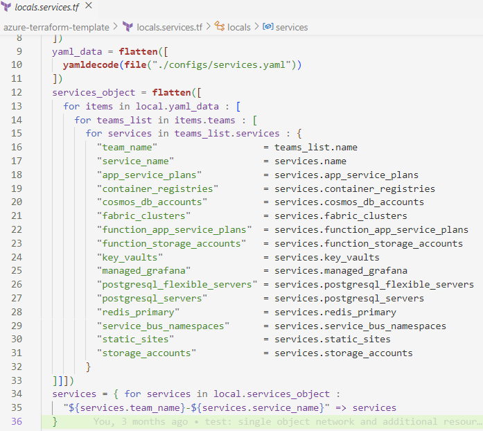
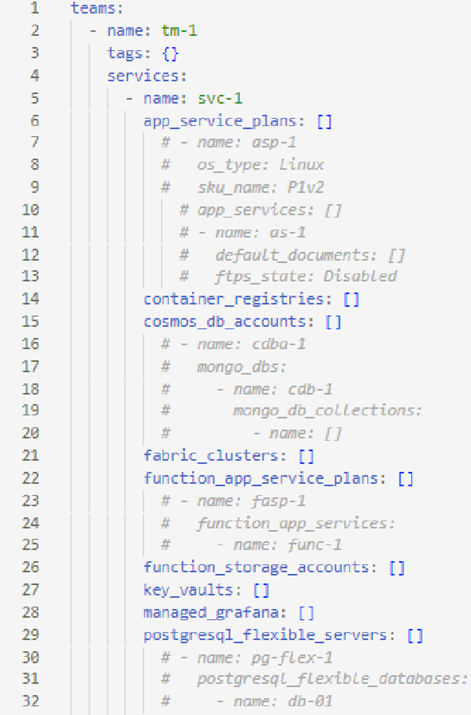
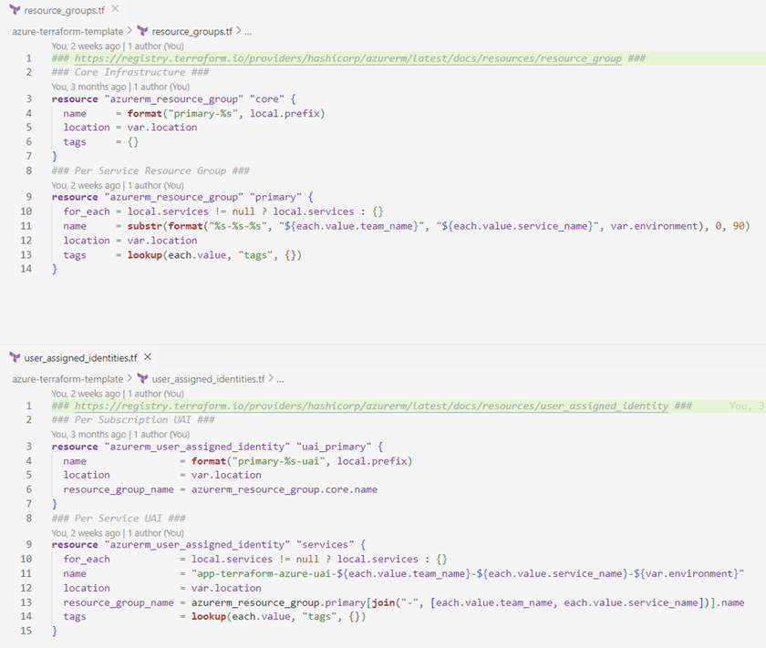
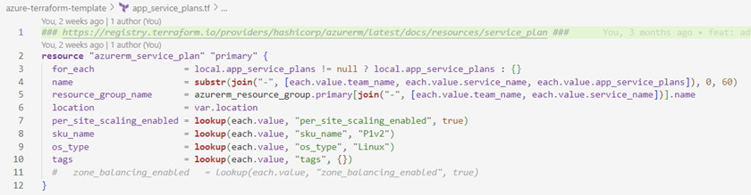
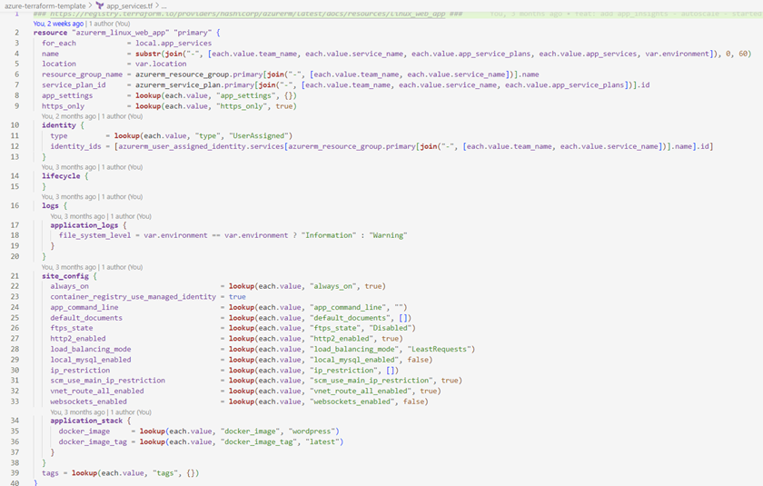

# INFRASTRUCTURE ON DEMAND

## A UNIQUE WAY TO WRITE TERRAFORM

### THE BENITEZ-JOHNSON METHOD

# DRAFT-REQUEST FOR COMMENT

Authored by

Mr. Dave Johnson

and

Mr. Christian Benitez
# 
## TRADEMARKS AND DISCLAIMERS, ACKNOWLEDGEMENTS
Special thanks are given to the following people:
…purged for privacy… you know who you are. Thank you for the mentorship and guidance along this journey.

Copyright © 2023 Dave Johnson and Christian Benitez

Permission is hereby granted, free of charge, to any person obtaining a copy of this software and associated documentation files (the “Software”), to deal in the Software without restriction, including without limitation the rights to use, copy, modify, merge, publish, distribute, sublicense, and/or sell copies of the Software, and to permit persons to whom the Software is furnished to do so, subject to the following conditions:
The above copyright notice and this permission notice shall be included in all copies or substantial portions of the Software.

THE SOFTWARE IS PROVIDED “AS IS”, WITHOUT WARRANTY OF ANY KIND, EXPRESS OR IMPLIED, INCLUDING BUT NOT LIMITED TO THE WARRANTIES OF MERCHANTABILITY, FITNESS FOR A PARTICULAR PURPOSE AND NONINFRINGEMENT. IN NO EVENT SHALL THE AUTHORS OR COPYRIGHT HOLDERS BE LIABLE FOR ANY CLAIM, DAMAGES OR OTHER LIABILITY, WHETHER IN AN ACTION OF CONTRACT, TORT OR OTHERWISE, ARISING FROM, OUT OF OR IN CONNECTION WITH THE SOFTWARE OR THE USE OR OTHER DEALINGS IN THE SOFTWARE.
	
Copyright © 2023

All rights reserved. January 2023. Printed in Canada

#
## INFRASTRUCTURE ON DEMAND
#
### INTRODUCTION
Infrastructure as Code (IAC) has become an increasingly important practice in modern software development. As applications and services continue to scale, the management and provisioning of infrastructure has become increasingly complex. This has led to the rise of IAC, which is the process of provisioning and managing infrastructure using code, rather than manual input. IAC allows for version control and automation of changes, making it a powerful tool for managing both small and large-scale infrastructure alike.

Despite the benefits of IAC, it can be challenging to implement in practice, especially for large-scale projects. The complexity and size of the infrastructure can lead to errors and inconsistencies and managing dependencies and changes across multiple teams and technologies can be difficult. To address these challenges, the Benitez-Johnson method was developed by Dave Johnson and Christian Benitez.

The Benitez-Johnson method is an approach for creating Terraform using pure HCL that prioritizes efficiency and simplicity. The method has four main principles:

Minimization: The goal is to write the least amount of Terraform code possible, while still achieving the desired infrastructure configuration. This helps to make the code more readable and maintainable.
Configuration as code: The method emphasizes the use of configuration files, rather than HCL blocks, to define infrastructure. This allows the use of common formats like YAML and JSON to be used to define the infrastructure to be provisioned.

Optimization: The method aims to optimize the infrastructure by using best practices, such as using modules and reusable code, to reduce duplicated effort and improve scalability. Reduction and removal of local modules would be a perfect example of this.

Efficiency: The method aims to make the process of managing infrastructure as code as easy and efficient as possible, while still maintaining the necessary level of flexibility and scalability. In this paradigm we aim to consider all aspects of performance from state-file size to execution time.
#
### KEY BENEFITS
The Benitez-Johnson method enables on-demand infrastructure. By using configuration as code, the method allows for infrastructure to be provisioned and deprovisioned with ease. As business needs change infrastructure can change too (Yes, even in Terraform Enterprise/Cloud). This can help to ensure that resources are only used when they are needed, which can lead to cost savings and improved scalability. Additionally, the method promotes effective communication and collaboration between the technical team, which can further improve the infrastructure provisioning process. Infrastructure developers can rely on a common base allowing critical cross functionality whereby everyone has a common understanding of how Terraform code is built and implemented allowing faster team onboarding and maximizing velocity.

One of the key benefits of using the Benitez-Johnson method is that it allows for clear separation of concerns between developers and platform engineers/DevOps. Developers can focus on writing code and provisioning infrastructure in a familiar format, such as YAML or JSON, while platform engineers and DevOps are responsible for designing and maintaining the underlying systems and Terraform loops.

This separation of concerns can lead to several benefits. For developers, it allows them to work more efficiently, as they can use familiar tools and formats to provision infrastructure. Additionally, it reduces the cognitive load on developers, as they do not need to be experts in Terraform or the underlying systems. Instead, they can focus on their core competency, which is writing code.

For platform engineers and DevOps, the Benitez-Johnson method allows them to focus on designing and maintaining the Terraform loops, which can be a complex and time-consuming task. By minimizing the amount of code written, they can reduce the complexity and reduce the chances of errors and inconsistencies. Additionally, by using the method, they can ensure that the infrastructure is designed and maintained in a consistent and efficient way, which can lead to improved scalability and ultimately affect a company’s time to market.

Another important aspect of the Benitez-Johnson method is the size of the state-file that is generated by Terraform. A smaller state-file size allows for faster build and deployment of infrastructure, as it reduces the amount of data that needs to be processed. This is particularly important when working with large-scale infrastructure, as it can significantly speed up the provisioning process. In the real world we have seen plan times ranging from 10 minutes to almost an hour with some of the larger states. Building in this way we leverage the Terraform language to be able to support smaller state-files.
#
### DEEP DIVE
The Benitez-Johnson method allows for a clear separation of concerns between developers and platform engineers/DevOps. This can lead to improved efficiency and reduced cognitive load for developers, while allowing platform engineers and DevOps to focus on designing and maintaining the Terraform loops and underlying systems. Additionally, the method emphasizes on minimizing the amount of code written and this can lead to improved scalability. The size of the state-file also plays an important role in the process, as it can significantly speed up the provisioning process when working with large-scale infrastructure.
#
### Please see the following as an example of how this can be used to provision infrastructure in the Azure Cloud

This is the primary service-object and service loop. As you can see, we are creating a base structure with our YAML and can build from the main local “services” on line 34.

#
If setup to do so you can build certain resources that are required at certain levels… for instance… Each time you add another team it would be nice to have a resource group and a managed identity per service, right? This can be achieved by using the code in the example below.

#
There are a few things to note about the code below.

First, the top code blocks are static and build out resources for core infrastructure… it is here you would include common single blocks of code keeping in mind the tenets of the Benitez-Johnson method. This example builds a resource group for these core or shared resources for the entire subscription. 

Second, the blocks starting on lines 9 are where our loops are building from the “services” local as defined above. These blocks are set to define a new RG and UAI each time you define a new team and service within that team so the resources would be named according to the code on line 11 in each example where we are utilizing different built in Terraform functions to affect the outcome of the name. I would encourage you to deep dive on the various functions in Terraform as not all are used here! 

Third, please review the code on line 13 in the “azurerm_user_assigned_identity” example to put the looped UAIs in the right resource group we need to access the list and found that the easiest way to do this was to use the “join” function to generate the key created by the “services” local. 

Finally, we use the lookup function to define any value that may need to be overridden later. In this example the tags have been set to look for a value but if nothing is defined it will default to null. In this way you can ensure successful Terraform runs for your teams each-and-every time

#
Consider this resources example, here you can see I am building out an app service plan to hold N number of app services to nest the objects properly I have included an extra for loop in the app_services_object so we have access to those values. I have also included the plan and the service name in the  app_services loop on line 69.

#
In the example, below we can see the resource blocks building from different locals. This allows us to only trigger the build on the addition of a definition in the YAML file and if no values are present for the app_services then only the app_service_plans are built out.

#
In the example below there are definitions for various resources but to continue our work above let’s pay attention to lines 6 through 13 where we define the app_service_plan and subsequent app_service. These definitions can be split up or customized to fit your particular use case. As the design scales it may make sense to use multiple files to avoid having one large locals.tf file. To build the services remove the “[]” at the end of “app_service_plans”

#
### CONCLUSION
The Benitez-Johnson method is a unique and effective approach to infrastructure provisioning using Terraform. The method is based on four main principles: minimization, configuration as code, optimization, and efficiency. The goal of minimization is to write the minimum amount of Terraform code possible, while still achieving the desired infrastructure configuration, making the code more readable and maintainable. The use of configuration as code, such as YAML and JSON, allows for more familiarity and ease of use for developers.

The optimization principle focuses on using best practices to reduce duplicated effort and improve scalability. This includes using modules and reusable code to create a more efficient infrastructure. Additionally, the method aims to optimize performance, including the size of the statefile and execution time.

Finally, the principle of efficiency seeks to make the process of managing infrastructure as code as easy and efficient as possible, while still maintaining the necessary level of flexibility and scalability. By following the Benitez-Johnson method, organizations can improve their infrastructure provisioning process and reduce the risk of errors and inconsistencies.

In summary, the Benitez-Johnson method provides a comprehensive approach to infrastructure provisioning that balances the needs of developers, platform engineers, and DevOps. The method was designed by Dave Johnson and Christian Benitez and is becoming increasingly popular for its ability to improve the efficiency and scalability of large-scale infrastructure provisioning processes.
#